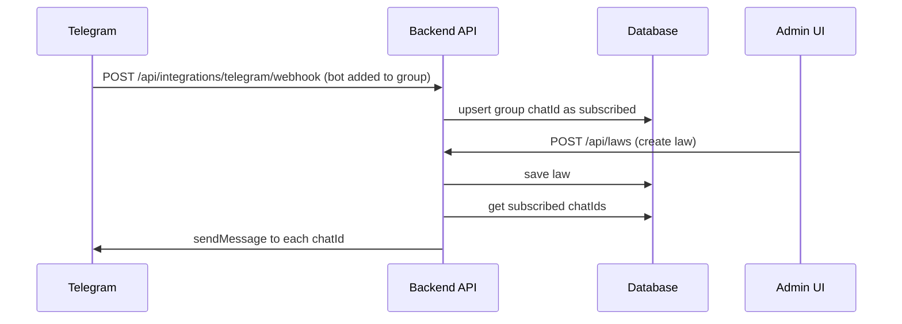

# Telegram Bot Integration for Law Module

## Goal

Automatically post a message to Telegram when an admin creates a new law.

This document covers:
- Basic mode: post to one configured group
- Advanced mode: auto-subscribe groups when the bot is added
- Suggested backend architecture for your current NSPC CMS project

---

## 1) Is this possible?

Yes.

Telegram supports this flow through:
- Bot API sendMessage/sendDocument for posting
- Updates webhook for receiving group events (such as bot added to group)

So the full requirement is possible:
1. Admin creates law in CMS
2. Backend stores law
3. Backend notifies Telegram
4. Bot posts to target group(s)

---

## 2) Integration Modes

## Mode A: Single Group (MVP)

Use one Telegram group ChatId in config.
Whenever a law is created, backend posts to that ChatId.

Pros:
- Fastest to build
- Very little complexity

Cons:
- Only one group unless config is changed

## Mode B: Auto Group Subscription (Recommended long-term)

When bot is added to a group, Telegram sends update to your webhook.
You store that group ChatId in database as subscribed.
When a law is created, backend broadcasts to all subscribed groups.

Pros:
- Works exactly as requested when adding bot to group
- Scales to multiple groups

Cons:
- Requires webhook endpoint + subscription table

---

## 3) Required Bot Setup (Telegram)

1. Open BotFather and create bot.
2. Save bot token securely.
3. Add bot to your Telegram group.
4. Give bot permission to post in group.
5. Disable privacy mode if you need broader group updates (optional, based on commands/use case).
6. For Mode B, set webhook URL to backend endpoint.

---

## 4) Backend Design for NSPC CMS

Current law create flow is in:
- Backend/Controllers/LawsController.cs

Register services in:
- Backend/Program.cs

Config in:
- Backend/appsettings.example.json

## 4.1 Suggested new services

- ITelegramNotificationService
  - SendLawCreatedAsync(lawDto)
  - BroadcastLawCreatedAsync(lawDto, chatIds)

- TelegramNotificationService
  - Uses HttpClient to call Telegram API
  - Handles message formatting and failure logging

- TelegramUpdateService (Mode B)
  - Processes webhook updates
  - Extracts group chat IDs from my_chat_member updates
  - Stores/removes subscriptions

## 4.2 Suggested new config section

Add to appsettings.example.json:

```json
"Telegram": {
  "BotToken": "",
  "DefaultChatId": "",
  "WebhookSecret": "",
  "EnableLawNotifications": true,
  "PublicLawBaseUrl": "http://localhost:3000/Landing-page/Resources/Laws"
}
```

Notes:
- Keep BotToken only in secrets/env vars, not committed.
- DefaultChatId is enough for Mode A MVP.

---

## 5) Law Create Trigger Point

In LawsController create endpoint:
1. Save law + translations to DB
2. Build message payload
3. Call Telegram notification service
4. Return API success even if Telegram fails (log error)

Reason: law creation should not fail if Telegram is temporarily unavailable.

---

## 6) Message Format Recommendation

Use concise, bilingual-friendly format:

```text
New law published
Category: <category>
Date: <date>
Khmer title: <km title>
English title: <en title>
Read more: <public url>
```

Optional:
- Include PDF link
- Include hashtag by category

---

## 7) Webhook Flow for Auto Group Subscription (Mode B)



Important:
- Validate webhook secret/header.
- Handle bot removed events and unsubscribe group.

---

## 8) Data Model for Group Subscriptions (Mode B)

Suggested table/entity:

- TelegramSubscription
  - Id (guid)
  - ChatId (string, unique)
  - ChatTitle (string)
  - ChatType (group/supergroup/channel)
  - IsActive (bool)
  - CreatedAt
  - UpdatedAt

---

## 9) Reliability and Security

## Reliability

- Use fire-and-forget queue or background worker for send operations.
- Retry transient failures (HTTP 429/5xx with backoff).
- Prevent duplicate posts with idempotency key per law+chat.

## Security

- Do not expose bot token in source control.
- Store token in user-secrets or environment variables.
- Validate webhook secret token.
- Log errors without leaking token.

---

## 10) Step-by-step Implementation Plan

## Phase 1 (MVP)

1. Add Telegram config section.
2. Add TelegramNotificationService with sendMessage.
3. Register service in Program.cs.
4. Call service in LawsController Create after DB save.
5. Test with one group ChatId.

## Phase 2 (Auto-subscribe groups)

1. Add TelegramSubscription entity + migration.
2. Add webhook controller endpoint.
3. Process my_chat_member updates for add/remove.
4. Broadcast law notifications to active subscriptions.
5. Add simple admin page to view/remove subscriptions (optional).

---

## 11) Definition of Done

Complete when:
- New law creation triggers Telegram post.
- Bot posts to configured group(s).
- If bot is added to a group, that group can be auto-subscribed (Mode B).
- Law creation still succeeds even if Telegram API fails.
- Bot token is stored securely.

---

## 12) Testing Checklist

- Create law with Khmer only and verify Telegram post.
- Create law with Khmer + English and verify both titles in message.
- Invalid bot token should not break law creation API.
- Network failure should log error and keep API success.
- For Mode B: add bot to new group and confirm auto-subscription.
- For Mode B: remove bot and confirm unsubscribe behavior.

---

If needed, this can be extended into a reusable generic integration doc for other modules (News, Publications, Alerts) using the same event-driven pattern.