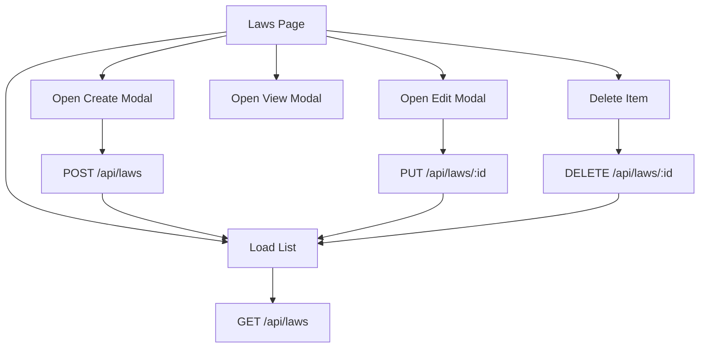

# Law Module Flow - Reusable Blueprint

This document explains the current Law module flow and turns it into a reusable implementation pattern so we can build similar modules faster (for example: Regulation, Policy, Notice, or Publication-like features).

## 1) Purpose

Use this file as:
- The shared reference before implementation
- The checklist during implementation
- The QA baseline after implementation

Goal: keep one clear flow from UI -> API -> database -> UI refresh, with consistent multilingual behavior and file upload handling.

---

## 2) Current Law Module Architecture

### Main admin files

- [src/app/(admin)/laws/page.tsx](src/app/(admin)/laws/page.tsx): page orchestrator (state, API calls, modals)
- [src/components/laws/LawTable.tsx](src/components/laws/LawTable.tsx): list + row actions
- [src/components/laws/LawFilters.tsx](src/components/laws/LawFilters.tsx): search + category filter
- [src/components/laws/LawForm.tsx](src/components/laws/LawForm.tsx): create form
- [src/components/laws/LawEditForm.tsx](src/components/laws/LawEditForm.tsx): edit form
- [src/components/laws/PdfDropZone.tsx](src/components/laws/PdfDropZone.tsx): PDF upload UI
- [src/components/laws/Toast.tsx](src/components/laws/Toast.tsx): local form-level toast
- [src/lib/pickTranslation.ts](src/lib/pickTranslation.ts): language fallback helper

### Flow diagram



---

## 3) End-to-End CRUD Flow (Law)

### 3.1 List (Read)

1. Page mounts and checks session/token.
2. Calls `GET /api/laws`.
3. Stores result in `laws` state.
4. Applies client-side category/search filter.
5. Renders filtered list in table.

### 3.2 Create

1. Click `New Law`.
2. Open create modal with `LawForm`.
3. Fill base fields (`Category`, `Date`) and `translations[]`.
4. Optional PDF upload per translation via `PdfDropZone`.
5. Validate required fields (especially Khmer/default title).
6. Build multipart `FormData`.
7. Submit `POST /api/laws`.
8. Close modal and reload list on success.

### 3.3 Edit

1. Click edit action in table.
2. Open edit modal with selected `initialLaw`.
3. Hydrate form state from existing translations.
4. Update values and optional new PDFs.
5. Validate, build `FormData`, submit `PUT /api/laws/:id`.
6. Close modal and reload list on success.

### 3.4 Delete

1. Click delete action in table.
2. Confirm in modal.
3. Submit `DELETE /api/laws/:id`.
4. Reload list.

### 3.5 View Detail

1. Click law title or view action.
2. Open view modal.
3. Show all translations + PDF links.

---

## 4) API Contract (Law Pattern)

### Admin endpoints (protected)

- `GET /api/laws`
- `POST /api/laws`
- `PUT /api/laws/{id}`
- `DELETE /api/laws/{id}`

### Public endpoints (optional, unprotected)

- `GET /api/public/laws`
- `GET /api/public/laws/{id}`

### Multipart payload pattern

```text
Category: string
Date?: string
Translations[0].Language: "km"
Translations[0].Title: string
Translations[0].Description?: string
Translations[0].PdfFile?: File
Translations[1].Language: "en"
...
```

---

## 5) Reusable Blueprint for Any Similar Module

When creating a new module, replace `Law` with your module name (example `Regulation`).

### 5.1 File/folder template

```text
src/app/(admin)/{module}/
  page.tsx

src/components/{module}/
  {Module}Table.tsx
  {Module}Filters.tsx
  {Module}Form.tsx
  {Module}EditForm.tsx   (or merge with Form using initialData?)

src/lib/
  pickTranslation.ts      (reuse)
```

### 5.2 Naming map

- `Law` -> `{Module}`
- `/api/laws` -> `/api/{module-endpoint}`
- `LawForm.*` translation keys -> `{Module}Form.*`
- `LawTable.*` translation keys -> `{Module}Table.*`

### 5.3 State contract in page orchestrator

Minimum page state:

```ts
items: ModuleItem[]
loading: boolean
error: string | null
search: string
category: string
createOpen: boolean
viewOpen: boolean
editingItem: ModuleItem | null
selectedItem: ModuleItem | null
```

### 5.4 Minimal operations

- `load()` -> list endpoint
- `handleCreated()` -> close modal + `load()`
- `handleUpdated()` -> close modal + `load()`
- `handleDelete(id)` -> delete endpoint + `load()`

---

## 6) Implementation Checklist (Copy/Paste Ready)

## Backend

- [ ] Add model + translation model (if multilingual)
- [ ] Add DTOs for create/update/list/detail
- [ ] Add mapper profile updates
- [ ] Add controller endpoints (GET/POST/PUT/DELETE)
- [ ] Add validation (required default language title, file type/size)
- [ ] Add migration and update DB

## Admin UI

- [ ] Add page orchestrator route under `src/app/(admin)/{module}/page.tsx`
- [ ] Add filters, table, create/edit form components
- [ ] Add view and delete confirmation modals
- [ ] Connect API with auth token
- [ ] Add loading, error, and empty states
- [ ] Add delete loading lock to prevent duplicate requests

## i18n

- [ ] Add translation keys in [messages/en.json](messages/en.json)
- [ ] Add translation keys in [messages/kh.json](messages/kh.json)
- [ ] Ensure labels/errors/buttons are translated

## QA

- [ ] Create with Khmer only
- [ ] Create with Khmer + English
- [ ] Edit and replace PDF
- [ ] Delete item and verify table refresh
- [ ] Verify failed API shows meaningful message
- [ ] Verify token expiry behavior

---

## 7) Rules We Should Keep for Similar Modules

1. Default language (`km`) cannot be removed.
2. Do not submit if default language title is empty.
3. Always use multipart when file upload is possible.
4. Keep list API and form submit API separate and explicit.
5. Keep a single page orchestrator responsible for reload flow.
6. Reuse shared utilities (`pickTranslation`, common toast/modal patterns).

---

## 8) Recommended Improvements (Apply to Law and New Modules)

1. Merge create/edit into one component with `initialData?` to reduce duplication.
2. Extract constants (`API_BASE`, category options) into shared files.
3. Prevent stale list races with `AbortController` in `load()`.
4. Add retry UI on list fetch failure.
5. Move from client-side filtering to server-side filtering when pagination is added.

---

## 9) Definition of Done for New Module

A new module is considered complete when:

- CRUD works end-to-end with authenticated APIs.
- Khmer-first multilingual rules are enforced.
- File uploads are validated and persisted.
- Admin list can search/filter reliably.
- Errors are specific and user-friendly.
- The implementation follows the same orchestration pattern as Law.

---

If needed, we can also create a second document named `module_blueprint.md` and keep this file (`law_management_flow.md`) focused only on Law-specific behavior.