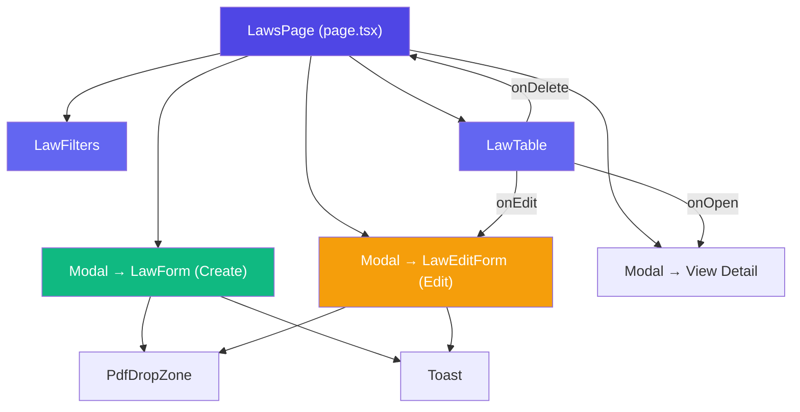
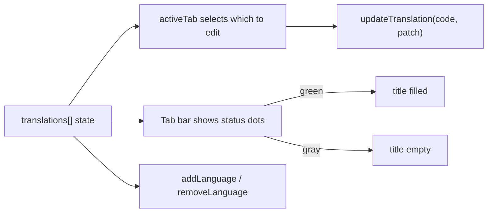
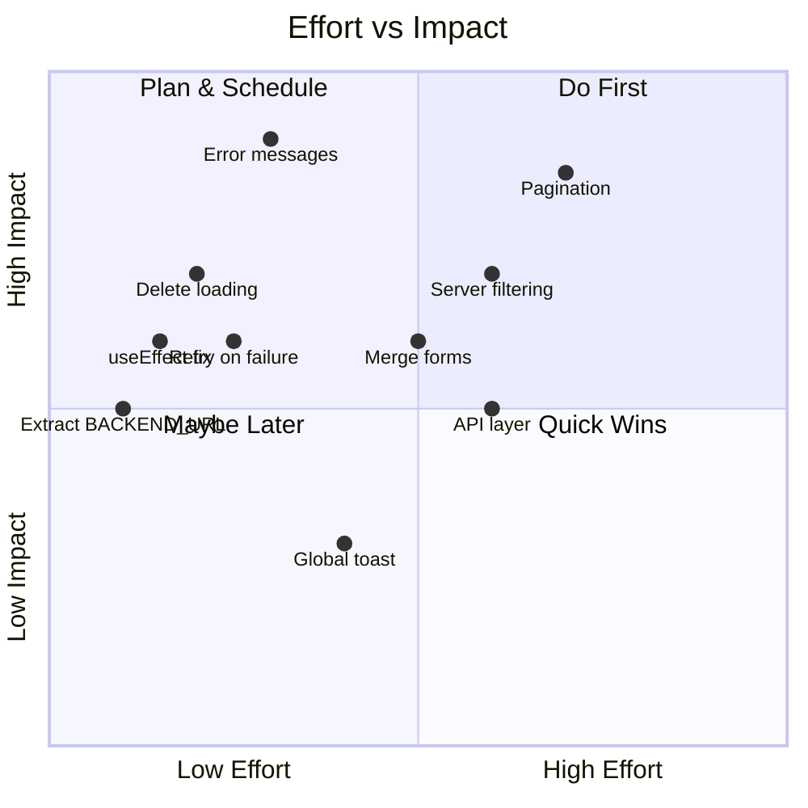

# Law Management — Flow & Architecture Review

## Overview

The Law module is a full CRUD feature inside the **NSPC CMS Admin** (Next.js + NextAuth). It manages multilingual law entries with PDF attachments.

---

## Architecture Diagram



---

## Component Responsibilities

| Component | Role | Lines |
|---|---|---|
| [page.tsx](file:///Users/vathna/iCloud%20Drive%20(Archive)/Documents/NSPC%20CMS/Admin/src/app/(admin)/laws/page.tsx) | Page orchestrator — state, API calls, modals | 215 |
| [LawForm.tsx](file:///Users/vathna/iCloud%20Drive%20(Archive)/Documents/NSPC%20CMS/Admin/src/components/laws/LawForm.tsx) | **Create** form — validation, multipart submit | 422 |
| [LawEditForm.tsx](file:///Users/vathna/iCloud%20Drive%20(Archive)/Documents/NSPC%20CMS/Admin/src/components/laws/LawEditForm.tsx) | **Edit** form — hydrates from `initialLaw`, PUT | 465 |
| [LawTable.tsx](file:///Users/vathna/iCloud%20Drive%20(Archive)/Documents/NSPC%20CMS/Admin/src/components/laws/LawTable.tsx) | **List** — table display, delete confirmation | 267 |
| [LawFilters.tsx](file:///Users/vathna/iCloud%20Drive%20(Archive)/Documents/NSPC%20CMS/Admin/src/components/laws/LawFilters.tsx) | Category pill filters + search input | 59 |
| [PdfDropZone.tsx](file:///Users/vathna/iCloud%20Drive%20(Archive)/Documents/NSPC%20CMS/Admin/src/components/laws/PdfDropZone.tsx) | Drag & drop PDF upload (10 MB limit) | 96 |
| [Toast.tsx](file:///Users/vathna/iCloud%20Drive%20(Archive)/Documents/NSPC%20CMS/Admin/src/components/laws/Toast.tsx) | Auto-dismiss success/error notification | 21 |
| [pickTranslation.ts](file:///Users/vathna/iCloud%20Drive%20(Archive)/Documents/NSPC%20CMS/Admin/src/lib/pickTranslation.ts) | Utility — picks the best translation for locale | 26 |

---

## Data Flow — Full CRUD

### 1. List (READ)

```
page.tsx → load() → GET /api/laws (Bearer token)
         → setLaws(data.items)
         → LawFilters (client-side search + category filter)
         → LawTable renders filteredLaws
```

### 2. Create

```
User clicks "New Law" → setCreateOpen(true) → Modal opens → LawForm
  └─ Form fields: Category*, Date, Translations[]{Language, Title*, Description?, PdfFile?}
  └─ validate() → builds FormData → POST /api/laws (multipart)
  └─ onSaved → handleCreated() → closes modal + re-fetches list
```

### 3. Edit (UPDATE)

```
User clicks edit icon on a row → setEditingLaw(law) + setCreateOpen(true) → Modal opens → LawEditForm
  └─ useEffect hydrates form from initialLaw
  └─ Same fields as create, plus existingPdfUrl display
  └─ validate() → builds FormData → PUT /api/laws/{id} (multipart)
  └─ onSaved → handleCreated() → closes modal + re-fetches list
```

### 4. Delete

```
User clicks delete icon → LawTable opens delete confirmation Modal
  └─ onDelete(id) → page.tsx handleDelete() → DELETE /api/laws/{id}
  └─ re-fetches list
```

### 5. View Detail

```
User clicks law title → setSelectedLaw(l) + setViewOpen(true)
  └─ Modal displays all translations with PDF links
```

---

## API Contracts

| Action | Method | Endpoint | Body | Auth |
|---|---|---|---|---|
| List | `GET` | `/api/laws` | — | Bearer |
| Create | `POST` | `/api/laws` | `FormData` (multipart) | Bearer |
| Update | `PUT` | `/api/laws/{id}` | `FormData` (multipart) | Bearer |
| Delete | `DELETE` | `/api/laws/{id}` | — | Bearer |

### FormData Shape (Create / Update)

```
Category: string
Date?: string
Translations[0].Language: "km"
Translations[0].Title: string
Translations[0].Description?: string
Translations[0].PdfFile?: File
Translations[1].Language: "en"
...
```

---

## Multi-Language System



- **Default language**: Khmer (`km`) — cannot be removed
- **Supported**: `km`, [en](file:///Users/vathna/iCloud%20Drive%20%28Archive%29/Documents/NSPC%20CMS/Admin/src/app/%28admin%29/laws/page.tsx#71-75) — extensible via `SUPPORTED_LANGUAGES`
- **Tab status**: green dot = title filled, gray = empty
- **Warning banner** shown if you're editing a non-default tab but the default (km) title is empty

---

## ✅ Review: Is This the Right Pattern?

### What's Done Well

1. **Clear separation** — Page orchestrates, components are focused
2. **Consistent multilingual pattern** — `translations[]` array with per-language tabs works cleanly
3. **FormData multipart** — Correct approach for file uploads
4. **Client-side validation** — Catches errors before API call, focuses the tab with issues
5. **Confirmation modals** — Both close-with-unsaved-changes and delete have confirmations
6. **i18n via `next-intl`** — All UI strings are translatable
7. **[pickTranslation](file:///Users/vathna/iCloud%20Drive%20%28Archive%29/Documents/NSPC%20CMS/Admin/src/lib/pickTranslation.ts#9-26) utility** — Reusable locale-aware translation picker

### Improvement Suggestions for Reuse

> [!IMPORTANT]
> These are **not blockers** — the current code works correctly. These are refinements to consider when building similar modules.

| # | Suggestion | Impact |
|---|---|---|
| 1 | **Merge [LawForm](file:///Users/vathna/iCloud%20Drive%20%28Archive%29/Documents/NSPC%20CMS/Admin/src/components/laws/LawForm.tsx#59-421) + [LawEditForm](file:///Users/vathna/iCloud%20Drive%20%28Archive%29/Documents/NSPC%20CMS/Admin/src/components/laws/LawEditForm.tsx#70-465)** into one component with an `initialData?` prop. They share ~90% identical code. | Less duplication, easier maintenance |
| 2 | **Extract shared hooks** like `useMultiLangForm(config)` to encapsulate translation state, validation, tab management | Instant reuse for next module |
| 3 | **Move `CATEGORY_OPTIONS`** to a shared config or fetch from API | Avoid hardcoding in 3 places |
| 4 | **Move [Toast](file:///Users/vathna/iCloud%20Drive%20%28Archive%29/Documents/NSPC%20CMS/Admin/src/components/laws/Toast.tsx#4-21)** to a global context/provider instead of per-form | Single toast system app-wide |
| 5 | **Add optimistic UI** for delete instead of full re-fetch | Better UX |
| 6 | **Type-safe API layer** — wrap fetch calls in a typed `api.laws.create(form)` helper | Reusable across modules |

---

## 🔧 Fixes & Improvements for Production

### 🔴 Critical — Fix Before Production

| # | Issue | File(s) | What to Do |
|---|---|---|---|
| 1 | **Generic error messages** — API errors show a single toast with no details. Users won't know *what* went wrong (duplicate title? server down? invalid PDF?). | `LawForm.tsx:164`, `LawEditForm.tsx:208` | Parse `res.json()` on error responses and display specific backend validation messages in the toast or inline. |
| 2 | **No loading state on delete** — No visual feedback during deletion. Double-clicking fires duplicate `DELETE` requests. | `page.tsx:81-97` | Add a `deletingId` state, disable the delete button while in progress, and show a spinner. |
| 3 | **`useEffect` missing dependency** — [load()](file:///Users/vathna/iCloud%20Drive%20%28Archive%29/Documents/NSPC%20CMS/Admin/src/app/%28admin%29/laws/page.tsx#43-62) is declared inside the component but referenced inside `useEffect(() => { load(); }, [session, status])`. This causes stale closures and ESLint warnings. | `page.tsx:43-63` | Wrap [load](file:///Users/vathna/iCloud%20Drive%20%28Archive%29/Documents/NSPC%20CMS/Admin/src/app/%28admin%29/laws/page.tsx#43-62) in `useCallback` or move the fetch logic directly inside the `useEffect`. |
| 4 | **Race condition on rapid actions** — If user creates a law then immediately deletes another, two [load()](file:///Users/vathna/iCloud%20Drive%20%28Archive%29/Documents/NSPC%20CMS/Admin/src/app/%28admin%29/laws/page.tsx#43-62) calls race. The older response can overwrite the newer list. | [page.tsx](file:///Users/vathna/iCloud%20Drive%20%28Archive%29/Documents/NSPC%20CMS/Admin/src/app/%28admin%29/laws/page.tsx) | Use an `AbortController` to cancel stale requests, or add a request counter/flag. |

### 🟡 Important — Should Fix

| # | Issue | File(s) | What to Do |
|---|---|---|---|
| 5 | **No pagination** — [load()](file:///Users/vathna/iCloud%20Drive%20%28Archive%29/Documents/NSPC%20CMS/Admin/src/app/%28admin%29/laws/page.tsx#43-62) fetches ALL laws in one request. With 500+ records, this gets slow and wastes bandwidth. | `page.tsx:48` | Add `?page=1&pageSize=20` params to the API call. Add pagination controls to the UI. |
| 6 | **Client-only filtering** — Search and category filter run on the in-memory array. This breaks once pagination is added (you'd only filter the current page). | `page.tsx:113-129` | Move filtering to server-side query params (`?category=Civil+Law&q=search`). |
| 7 | **No retry on load failure** — If the initial `GET /api/laws` fails, the user sees an empty page with no way to recover. | `page.tsx:56-58` | Add an error state with a "Retry" button. Consider also showing a toast on list-fetch failure. |
| 8 | **`BACKEND_URL` repeated in 4 places** — Easy to miss one during env changes. | `page.tsx:47,85`, `LawForm.tsx:157`, `LawEditForm.tsx:202` | Extract to a shared constant: `const API_BASE = process.env.NEXT_PUBLIC_BACKEND_URL \|\| "http://localhost:5001"` in `src/lib/api.ts`. |
| 9 | **`CATEGORY_OPTIONS` hardcoded in 3 places** — page.tsx, LawForm.tsx, LawEditForm.tsx all define the same list independently. | All 3 files | Move to a shared `src/lib/constants/lawCategories.ts` or fetch from API. |
| 10 | **Date hydration issue in edit form** — `DatePicker` receives `defaultDate` as a string, but if the component doesn't re-mount after `applyInitialLaw`, the old date may persist visually. | `LawEditForm.tsx:303-309` | Add a `key={date}` to force re-mount, or use a controlled `value` prop instead of `defaultDate`. |

### 🟢 Nice to Have — Improve Over Time

| # | Issue | File(s) | What to Do |
|---|---|---|---|
| 11 | **Merge Create + Edit forms** — [LawForm](file:///Users/vathna/iCloud%20Drive%20%28Archive%29/Documents/NSPC%20CMS/Admin/src/components/laws/LawForm.tsx#59-421) and [LawEditForm](file:///Users/vathna/iCloud%20Drive%20%28Archive%29/Documents/NSPC%20CMS/Admin/src/components/laws/LawEditForm.tsx#70-465) share ~90% identical code (validation, tabs, translation state, UI). | Both form files | Create a single [LawForm](file:///Users/vathna/iCloud%20Drive%20%28Archive%29/Documents/NSPC%20CMS/Admin/src/components/laws/LawForm.tsx#59-421) with an optional `initialData?` prop. Use `POST` when no ID, `PUT` when ID exists. |
| 12 | **Extract `useMultiLangForm` hook** — Translation state, tab management, validation, add/remove language are all reusable logic. | Form files | Create `src/hooks/useMultiLangForm.ts` encapsulating `translations`, `activeTab`, `updateTranslation`, `addLanguage`, `removeLanguage`, [validate](file:///Users/vathna/iCloud%20Drive%20%28Archive%29/Documents/NSPC%20CMS/Admin/src/components/laws/LawForm.tsx#117-135). |
| 13 | **Global toast system** — Each form manages its own toast state. Multiple toasts can stack if modals overlap. | [Toast.tsx](file:///Users/vathna/iCloud%20Drive%20%28Archive%29/Documents/NSPC%20CMS/Admin/src/components/laws/Toast.tsx), form files | Create a `ToastProvider` context so any component can call `showToast()`. |
| 14 | **Type-safe API layer** — Raw `fetch` calls with manual URL construction are error-prone. | [page.tsx](file:///Users/vathna/iCloud%20Drive%20%28Archive%29/Documents/NSPC%20CMS/Admin/src/app/%28admin%29/laws/page.tsx), form files | Create `src/lib/api/laws.ts` with typed methods: `api.laws.list()`, `api.laws.create(form)`, `api.laws.update(id, form)`, `api.laws.delete(id)`. |
| 15 | **Optimistic delete** — Currently waits for the full [load()](file:///Users/vathna/iCloud%20Drive%20%28Archive%29/Documents/NSPC%20CMS/Admin/src/app/%28admin%29/laws/page.tsx#43-62) re-fetch after delete. UX feels slow. | `page.tsx:81-97` | Remove the item from the local [laws](file:///Users/vathna/iCloud%20Drive%20%28Archive%29/Documents/NSPC%20CMS/Admin/src/components/laws) state immediately, then re-fetch in background. Roll back on error. |
| 16 | **Move [PdfDropZone](file:///Users/vathna/iCloud%20Drive%20%28Archive%29/Documents/NSPC%20CMS/Admin/src/components/laws/PdfDropZone.tsx#13-96) and [Toast](file:///Users/vathna/iCloud%20Drive%20%28Archive%29/Documents/NSPC%20CMS/Admin/src/components/laws/Toast.tsx#4-21) to shared** — These are generic components sitting in [components/laws/](file:///Users/vathna/iCloud%20Drive%20%28Archive%29/Documents/NSPC%20CMS/Admin/src/components/laws). | Both files | Move to `src/components/shared/` or `src/components/ui/` for reuse across modules. |

### Summary Priority Matrix



---

## 🔁 Reusable Template for Similar Modules

When building the next similar module (e.g. Regulations, Decrees), follow this checklist:

```
📁 src/components/{module}/
├── {Module}Form.tsx        ← Create + Edit (unified with initialData? prop)
├── {Module}Table.tsx       ← List with actions (edit, delete, view)
├── {Module}Filters.tsx     ← Category/search filters
├── PdfDropZone.tsx         ← REUSE from laws/ (move to shared/)
└── Toast.tsx               ← REUSE (or global provider)

📁 src/app/(admin)/{module}/
└── page.tsx                ← Orchestrator (state, API, modals)

📁 src/lib/
└── pickTranslation.ts     ← REUSE as-is
```

### Step-by-step for a new module:

1. **Copy the file structure** above
2. **Define your type** (replace [Law](file:///Users/vathna/iCloud%20Drive%20%28Archive%29/Documents/NSPC%20CMS/Admin/src/components/laws/LawTable.tsx#18-24) → `Regulation`, adjust fields)
3. **Define `CATEGORY_OPTIONS`** (or fetch from API)
4. **Adjust API endpoints** (`/api/laws` → `/api/regulations`)
5. **Update translation keys** (`LawForm.*` → `RegulationForm.*`)
6. **Reuse** [PdfDropZone](file:///Users/vathna/iCloud%20Drive%20%28Archive%29/Documents/NSPC%20CMS/Admin/src/components/laws/PdfDropZone.tsx#13-96), [Toast](file:///Users/vathna/iCloud%20Drive%20%28Archive%29/Documents/NSPC%20CMS/Admin/src/components/laws/Toast.tsx#4-21), [pickTranslation](file:///Users/vathna/iCloud%20Drive%20%28Archive%29/Documents/NSPC%20CMS/Admin/src/lib/pickTranslation.ts#9-26) directly

> [!TIP]
> If you merge Create + Edit forms (suggestion #1), each new module only needs **4 files** instead of 5, and the shared hooks (suggestion #2) would cut each form down to ~100 lines.
