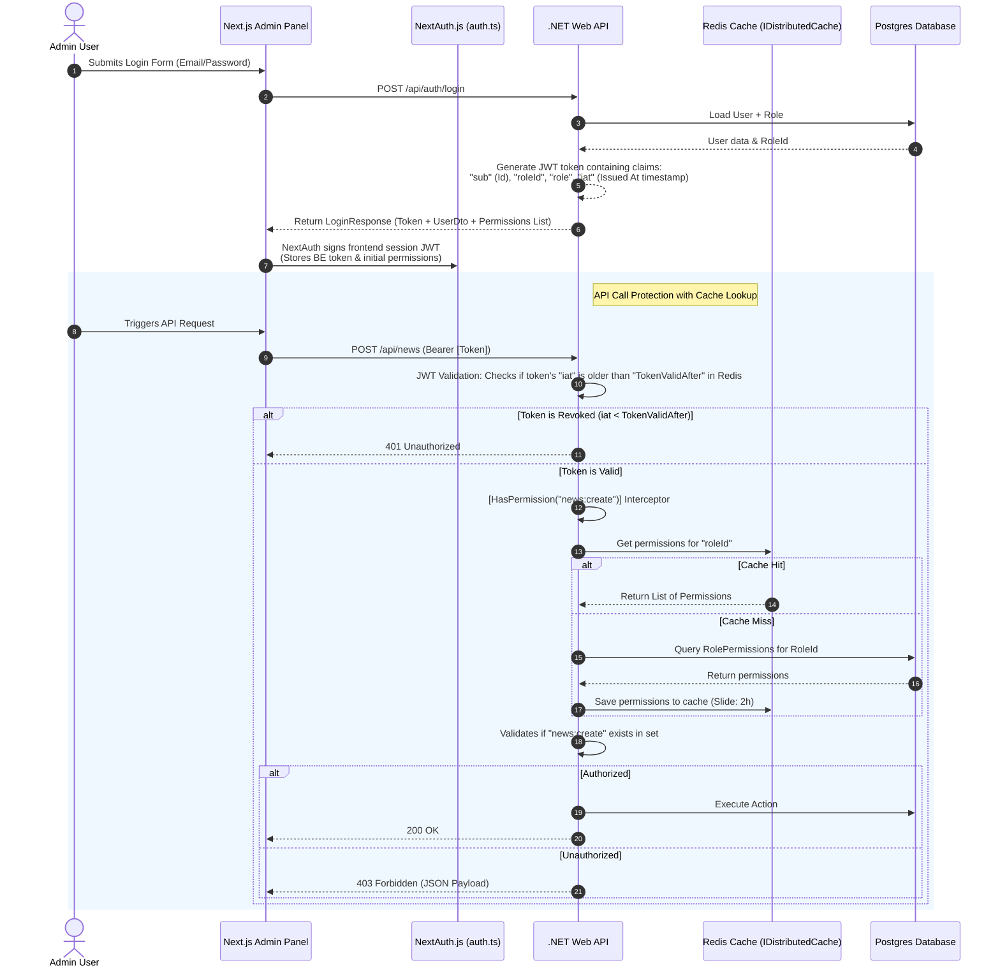

# Role & Permission Control Implementation (Single File)

## Decision Summary (Recommended)

- **Best option for this project now**: A Hybrid Claims + Backend Caching model with User-Specific Token Revocation timestamps.
- **Why**: Keeps JWT token size small and avoids bloat, resolves the stale permissions/roles problem instantly via a `TokenValidAfter` check, and secures endpoints using a distributed cache (Redis) for scalability.
- **Rule of thumb**: Embed only the `RoleId` and core identity claims in the JWT token. Resolve permissions on the backend using `IDistributedCache` (Redis). If a user's role is updated or blocked, update their `TokenValidAfter` timestamp in Postgres and Redis, instantly invalidating all outstanding tokens issued prior to that moment.

---

## 1. Objective

Implement dynamic Role-Based Access Control (RBAC) with fine-grained Permissions. The Admin panel will feature an interactive Role-Permission settings screen, while APIs and frontend routes dynamically adapt to the user's assigned permissions.

---

## 2. Why this approach is best for this project now

- **Solves Stale Permissions & Roles**: Revoking a permission is reflected instantly on the backend because cache invalidation clears cached permissions. Role updates or block actions instantly revoke active JWTs by invalidating tokens issued prior to the revocation timestamp.
- **Avoids Token Bloat**: Storing dozens of permission strings in a JWT header degrades request performance. Moving permissions to a distributed cache keeps the JWT compact.
- **Guards Deletion Integrity**: Roles cannot be deleted if users are currently assigned to them, preventing orphaned user accounts.
- **Secures Audit Trails**: Logs every role/permission modification, tracking who modified what permission and when.

---

## 3. Target architecture

### Source of truth

- User and Role relationships are persisted in the Postgres database.
- Permissions and User Revocation Timestamps are cached in a shared Redis cache (`IDistributedCache`).

### Runtime flow



### Scale Note: Multi-Instance Caching (Redis Setup)
To support horizontal scaling across multiple application instances, we replace `IMemoryCache` with `IDistributedCache` backed by Redis:

```csharp
// Program.cs configuration:
builder.Services.AddStackExchangeRedisCache(options =>
{
    options.Configuration = builder.Configuration.GetConnectionString("RedisConnection");
    options.InstanceName = "NspcCms_";
});
```

---

## 4. Data model

### Role
- Id (int, Primary Key)
- Name (string, Unique, e.g., "SuperAdmin", "Editor", "Viewer")
- Description (string, Nullable)
- IsSystemRole (bool, default false - protects system roles from deletion)

### Permission
- Id (int, Primary Key)
- Name (string, Unique, e.g., "news:create", "news:read")
- Description (string, Nullable)

### RolePermission (Junction Table)
- RoleId (int, PK, FK)
- PermissionId (int, PK, FK)

### User (Modifications)
- Remove: `Role` (string)
- Add: `RoleId` (int, FK)
- Add: `Role` (virtual reference navigation property)
- Add: `TokenValidAfter` (DateTime?, Nullable - Tracks token revocation events)

### SecurityAuditLog (New Table)
- Id (int, Primary Key)
- ActorUserId (int)
- ActorEmail (string)
- Action (string, e.g., "CreateRole", "UpdateRolePermissions", "DeleteRole", "ChangeUserRole", "RevokeUserToken")
- TargetId (string, e.g., Role ID or User ID affected)
- Details (string, JSON summary of changes storing human-readable names: `{ "OldPermissions": ["news:create", "news:read"], "NewPermissions": ["news:read"] }`)
- CreatedAt (DateTime)

---

## 5. API design

### Admin endpoints (roles & permissions)

- GET `/api/admin/roles` - Fetch all roles (Requires `roles:read`)
- POST `/api/admin/roles` - Create a new role (Requires `roles:create`)
- PUT `/api/admin/roles/{roleId}` - Edit role metadata (Requires `roles:update`)
- DELETE `/api/admin/roles/{roleId}` - Delete a role (Requires `roles:delete`)
- GET `/api/admin/permissions` - Fetch list of all system permissions (Requires `roles:read`)
- GET `/api/admin/roles/{roleId}/permissions` - Get permissions assigned to a role (Requires `roles:read`)
- PUT `/api/admin/roles/{roleId}/permissions` - Update permission list for a role (Requires `roles:update`)
- GET `/api/auth/verify-session` - Secure edge validation helper. Returns active permissions dynamically.

### Response contracts

#### `DELETE /api/admin/roles/{roleId}` Safety Rules:
- If a role is a system role (`IsSystemRole == true`), return `400 Bad Request`:
  ```json
  { "message": "System roles (SuperAdmin, Admin, User) cannot be deleted." }
  ```
- If a role has users assigned, return `409 Conflict`:
  ```json
  { "message": "Cannot delete role because it is currently assigned to 4 users. Reassign users first." }
  ```

#### Unified `403 Forbidden` API Response:
All endpoints protected by permissions must return a consistent JSON payload when rejected:
```json
{
  "status": 403,
  "error": "Forbidden",
  "message": "You do not have the required permission to perform this action. Required: news:create"
}
```

---

## 6. Admin dashboard flow

### Screens

1. **Roles Management Panel**
   - Lists roles, descriptions, user count per role.
   - Blocks deletion triggers on UI if role has users associated (displays warning tooltips) or if `IsSystemRole` is true.
2. **Interactive Permission Matrix**
   - Renders a checklist grid under `/settings/roles`.
   - Rows: Dynamic permissions list grouped by modules.
   - Columns: Roles (`Admin`, `Editor`, `Viewer`, etc.).
   - Cells: Toggle switches or checkboxes to add/remove permission mappings.
   - Dynamic: If a new permission is added to the database, the grid automatically renders it as a new row.

---

## 7. Validation and authorization rules

### 7.1 Standardized Permission Naming
To maintain absolute consistency, all modules enforce a granular 4-point CRUD naming schema:

```csharp
namespace Backend.Security
{
    public static class PermissionConstants
    {
        // News
        public const string NewsRead = "news:read";
        public const string NewsCreate = "news:create";
        public const string NewsUpdate = "news:update";
        public const string NewsDelete = "news:delete";

        // Videos
        public const string VideoRead = "video:read";
        public const string VideoCreate = "video:create";
        public const string VideoUpdate = "video:update";
        public const string VideoDelete = "video:delete";

        // Laws
        public const string LawsRead = "laws:read";
        public const string LawsCreate = "laws:create";
        public const string LawsUpdate = "laws:update";
        public const string LawsDelete = "laws:delete";

        // Publications
        public const string PublicationsRead = "publications:read";
        public const string PublicationsCreate = "publications:create";
        public const string PublicationsUpdate = "publications:update";
        public const string PublicationsDelete = "publications:delete";

        // Users Management
        public const string UsersRead = "users:read";
        public const string UsersCreate = "users:create";
        public const string UsersUpdate = "users:update";
        public const string UsersDelete = "users:delete";

        // Roles & Security Settings
        public const string RolesRead = "roles:read";
        public const string RolesCreate = "roles:create";
        public const string RolesUpdate = "roles:update";
        public const string RolesDelete = "roles:delete";
    }
}
```

---

## 8. Backend Implementation details (Dynamic Cache-Backed Auth)

### 8.1 Custom Authorization Handler with IDistributedCache
Instead of hardcoding a `SuperAdmin` exception check, we map `SuperAdmin` to all permissions inside seed data. This makes SuperAdmin actions 100% auditable and ensures validation logic is unified:

```csharp
using Microsoft.AspNetCore.Authorization;
using Microsoft.Extensions.Caching.Distributed;
using Microsoft.EntityFrameworkCore;
using System.Security.Claims;
using System.Text.Json;
using System.Threading.Tasks;
using System.Collections.Generic;
using System.Linq;
using Backend.Data;

namespace Backend.Security
{
    public class PermissionRequirement : IAuthorizationRequirement
    {
        public string Permission { get; }
        public PermissionRequirement(string permission) => Permission = permission;
    }

    public class PermissionAuthorizationHandler : AuthorizationHandler<PermissionRequirement>
    {
        private readonly IDistributedCache _cache;
        private readonly ApplicationDbContext _db;

        public PermissionAuthorizationHandler(IDistributedCache cache, ApplicationDbContext db)
        {
            _cache = cache;
            _db = db;
        }

        protected override async Task HandleRequirementAsync(AuthorizationHandlerContext context, PermissionRequirement requirement)
        {
            // 1. Extract RoleId from JWT claim
            var roleIdClaim = context.User.FindFirst("roleId")?.Value;
            if (string.IsNullOrEmpty(roleIdClaim) || !int.TryParse(roleIdClaim, out int roleId))
            {
                return; // Fail: No Role ID found in token
            }

            // 2. Resolve permissions using Redis Cache-Aside strategy
            var cacheKey = $"role_permissions_{roleId}";
            HashSet<string>? permissions = null;
            
            var cachedJson = await _cache.GetStringAsync(cacheKey);
            if (!string.IsNullOrEmpty(cachedJson))
            {
                permissions = JsonSerializer.Deserialize<HashSet<string>>(cachedJson);
            }
            else
            {
                // Cache miss: Load from Postgres
                var dbPermissions = await _db.RolePermissions
                    .Where(rp => rp.RoleId == roleId)
                    .Select(rp => rp.Permission.Name)
                    .ToListAsync();

                permissions = new HashSet<string>(dbPermissions);

                // Store in Redis cache
                var serializeOptions = new JsonSerializerOptions { WriteIndented = false };
                await _cache.SetStringAsync(cacheKey, JsonSerializer.Serialize(permissions, serializeOptions), new DistributedCacheEntryOptions
                {
                    AbsoluteExpirationRelativeToNow = TimeSpan.FromDays(1)
                });
            }

            // 3. Validate permission requirements
            if (permissions != null && permissions.Contains(requirement.Permission))
            {
                context.Succeed(requirement);
            }
        }
    }
}
```

### 8.2 Invalidation & Audit Logging (with Readable Names)
When modifying role permissions in the backend, record human-readable permission names in the audit log and clear the caching key. 

*Note: The check `role.Name == "SuperAdmin"` is kept here as a critical safety-net guard to prevent administrators from locking themselves out of the dashboard by accidentally removing key permissions from the SuperAdmin role.*

```csharp
[HttpPut("{roleId}/permissions")]
[HasPermission(PermissionConstants.RolesUpdate)]
public async Task<IActionResult> UpdatePermissions(int roleId, [FromBody] UpdatePermissionsRequest request)
{
    var role = await _db.Roles.FindAsync(roleId);
    if (role == null) return NotFound();
    if (role.Name == "SuperAdmin") return BadRequest("SuperAdmin permissions are locked for safety and cannot be modified.");

    var actorId = int.Parse(User.FindFirst(ClaimTypes.NameIdentifier)?.Value!);
    var actorEmail = User.FindFirst(ClaimTypes.Email)?.Value!;

    // Load existing permissions (storing names, not just IDs, for readable audit logs)
    var currentPermissions = await _db.RolePermissions
        .Where(rp => rp.RoleId == roleId)
        .Select(rp => rp.Permission.Name)
        .ToListAsync();

    // Load the target names of the new permissions to create a readable log diff
    var newPermissions = await _db.Permissions
        .Where(p => request.PermissionIds.Contains(p.Id))
        .Select(p => p.Name)
        .ToListAsync();

    // Update Database mappings
    var toRemove = _db.RolePermissions.Where(rp => rp.RoleId == roleId);
    _db.RolePermissions.RemoveRange(toRemove);

    foreach (var permId in request.PermissionIds)
    {
        _db.RolePermissions.Add(new RolePermission { RoleId = roleId, PermissionId = permId });
    }

    // Write Security Audit Log record with human-readable names
    var auditLog = new SecurityAuditLog
    {
        ActorUserId = actorId,
        ActorEmail = actorEmail,
        Action = "UpdateRolePermissions",
        TargetId = roleId.ToString(),
        Details = System.Text.Json.JsonSerializer.Serialize(new {
            OldPermissions = currentPermissions,
            NewPermissions = newPermissions
        }),
        CreatedAt = DateTime.UtcNow
    };
    _db.SecurityAuditLogs.Add(auditLog);

    await _db.SaveChangesAsync();

    // Invalidate Redis Cache instantly
    await _cache.RemoveAsync($"role_permissions_{roleId}");

    // Revoke tokens for all active users of this role so they are forced to fetch new credentials
    var affectedUserIds = await _db.Users.Where(u => u.RoleId == roleId).Select(u => u.Id).ToListAsync();
    foreach (var uId in affectedUserIds)
    {
        await RevokeUserTokensAsync(uId);
    }

    return Ok(new { message = "Permissions updated successfully." });
}
```

### 8.3 Token Revocation Engine (User Revocation Timestamp Model)
To avoid having to track individual `jti` keys during revocation, we assign a `TokenValidAfter` (DateTime) property to users. When a user is blocked or their role changes, set this timestamp to `DateTime.UtcNow`. 

During JWT validation, block any token issued (`iat`) before `TokenValidAfter`:

```csharp
// Program.cs JWT Bearer Events Configuration:
builder.Services.AddAuthentication(JwtBearerDefaults.AuthenticationScheme)
    .AddJwtBearer(options =>
    {
        options.TokenValidationParameters = new TokenValidationParameters
        {
            ValidateIssuer = true,
            ValidateAudience = true,
            ValidateLifetime = true,
            ValidateIssuerSigningKey = true,
            ValidIssuer = jwtIssuer,
            ValidAudience = jwtAudience,
            IssuerSigningKey = new SymmetricSecurityKey(Encoding.UTF8.GetBytes(jwtSecret)),
            RoleClaimType = ClaimTypes.Role,
            NameClaimType = ClaimTypes.Name
        };

        options.Events = new JwtBearerEvents
        {
            OnTokenValidated = async context =>
            {
                var cache = context.HttpContext.RequestServices.GetRequiredService<IDistributedCache>();
                var userIdClaim = context.Principal?.FindFirst(ClaimTypes.NameIdentifier)?.Value;
                var iatClaim = context.Principal?.FindFirst("iat")?.Value ?? 
                               context.Principal?.FindFirst(Microsoft.IdentityModel.JsonWebTokens.JwtRegisteredClaimNames.Iat)?.Value;

                if (!string.IsNullOrEmpty(userIdClaim) && !string.IsNullOrEmpty(iatClaim))
                {
                    var tokenIssuedAt = DateTimeOffset.FromUnixTimeSeconds(long.Parse(iatClaim)).UtcDateTime;
                    var cacheKey = $"user_revocation_time_{userIdClaim}";
                    
                    var cachedTimeStr = await cache.GetStringAsync(cacheKey);
                    DateTime? revocationTime = null;

                    if (!string.IsNullOrEmpty(cachedTimeStr))
                    {
                        revocationTime = JsonSerializer.Deserialize<DateTime>(cachedTimeStr);
                    }
                    else
                    {
                        // Cache miss: Load from DB and populate cache
                        var db = context.HttpContext.RequestServices.GetRequiredService<ApplicationDbContext>();
                        if (int.TryParse(userIdClaim, out int userId))
                        {
                            var user = await db.Users.FindAsync(userId);
                            if (user != null)
                            {
                                revocationTime = user.TokenValidAfter ?? DateTime.MinValue;
                                await cache.SetStringAsync(cacheKey, JsonSerializer.Serialize(revocationTime), new DistributedCacheEntryOptions
                                {
                                    AbsoluteExpirationRelativeToNow = TimeSpan.FromDays(1)
                                });
                            }
                        }
                    }

                    // Fail validation if the token was issued before the revocation timestamp
                    if (revocationTime.HasValue && tokenIssuedAt < revocationTime.Value)
                    {
                        context.Fail("Token has been revoked because user profile or role was modified.");
                    }
                }
            }
        };
    });
```

#### Revocation Trigger Helper Method:
When a user profile is updated, blocked, or their role changed, call this helper to invalidate their current tokens:
```csharp
public async Task RevokeUserTokensAsync(int userId)
{
    var user = await _db.Users.FindAsync(userId);
    if (user != null)
    {
        var revocationTime = DateTime.UtcNow;
        user.TokenValidAfter = revocationTime;
        await _db.SaveChangesAsync();

        // Sync Redis cache instantly
        await _cache.SetStringAsync($"user_revocation_time_{userId}", JsonSerializer.Serialize(revocationTime), new DistributedCacheEntryOptions
        {
            AbsoluteExpirationRelativeToNow = TimeSpan.FromDays(1)
        });
    }
}
```

---

## 9. Frontend NextAuth sync and validation

### 9.1 NextAuth Callbacks (`Admin/src/auth.ts`)
To keep the JWT token payload small, the backend JWT does not store the permission strings. Instead, the frontend fetches the user's permission list during the login transaction or via a user profile API, and stores it in the client-side NextAuth cookie session.

```typescript
authorize: async (credentials) => {
  const res = await fetch(`${BACKEND_URL}/api/auth/login`, {
    method: "POST",
    headers: { "Content-Type": "application/json" },
    body: JSON.stringify({
      email: credentials.email,
      password: credentials.password,
    }),
  });
  
  const data = await res.json();
  if (!res.ok) throw new Error(data?.message || "Login failed");

  return {
    id: data.user.id.toString(),
    email: data.user.email,
    name: data.user.fullName,
    role: data.user.role,
    accessToken: data.token,
    permissions: data.user.permissions || [], // Passed directly from backend API response object
  };
}
```

### 9.2 Optimized Session Sync Hook
Do **not** poll the backend `update()` function on every route/pathname change. This slows down navigation and overloads the server. Instead, use a dual refresh policy:
1. **Low Frequency Polling**: Refresh the session on a 5-minute interval.
2. **Explicit Action Refreshes**: Call the refresh hook explicitly only after performing write operations (like saving the role matrix or user profile changes).

```typescript
import { useSession } from "next-auth/react";
import { useEffect } from "react";

export function useSessionPermissionSync() {
  const { data: session, update } = useSession();

  // 1. Coarse interval sync: refresh every 5 minutes (300,000ms)
  useEffect(() => {
    if (!session) return;

    const interval = setInterval(() => {
      update();
    }, 300000); 

    return () => clearInterval(interval);
  }, [session, update]);

  // 2. Explicit trigger mechanism (Call this function manually after writing changes)
  const triggerImmediateSync = async () => {
    if (session) {
      await update();
    }
  };

  return { triggerImmediateSync };
}
```

---

## 10. Route Protection & Next.js Middleware

### Stale Cookie Mitigation: Middleware Live Validation with Throttling
Relying entirely on `req.auth.user.permissions` stored in the NextAuth cookie is vulnerable if a permission is revoked. For standard pages (like reading articles), reading from the cookie is fine. 

However, for **Highly Sensitive Paths** (like User Administration and Roles Matrix editing), the middleware should perform a server-to-server check directly against the backend's active permission states. To mitigate the latency of calling the backend on every page click, cache the verification result locally in memory for **60 seconds**:

```typescript
import { auth } from "@/auth";
import { NextResponse } from "next/server";

// Standard client-guarded paths
const CLIENT_GUARDED_ROUTES = [
  { path: "/news/create", permission: "news:create" },
];

// Sensitive security paths requiring live verification
const SENSITIVE_SECURITY_ROUTES = [
  { path: "/users", permission: "users:read" },
  { path: "/settings/roles", permission: "roles:read" },
];

const BACKEND_URL = process.env.NEXT_PUBLIC_BACKEND_URL || "http://localhost:5001";

// Lightweight local map cache (Key: UserID, Value: { permissions: string[], timestamp: number })
const middlewareCache = new Map<string, { permissions: string[]; timestamp: number }>();
const CACHE_TTL = 60000; // 60 seconds

export default auth(async (req) => {
  const { nextUrl } = req;
  const isLoggedIn = !!req.auth;
  const isAuthPath = nextUrl.pathname.startsWith("/Authentication/Login");

  if (!isLoggedIn && !isAuthPath) {
    return NextResponse.redirect(new URL("/Authentication/Login", nextUrl));
  }

  if (isLoggedIn) {
    if (isAuthPath) {
      return NextResponse.redirect(new URL("/", nextUrl));
    }

    const token = (req.auth as any).accessToken;
    const userId = (req.auth as any).user?.id;
    const userRole = (req.auth as any).user?.role;

    // SuperAdmin bypass
    if (userRole === "SuperAdmin") {
      return NextResponse.next();
    }

    // A. Check Highly Sensitive Pages (Live backend verification with memory cache throttling)
    const matchingSensitive = SENSITIVE_SECURITY_ROUTES.find((rule) => nextUrl.pathname.startsWith(rule.path));
    if (matchingSensitive) {
      let activePermissions: string[] = [];
      const cached = middlewareCache.get(userId);

      // Warning: In serverless/edge environments (like Vercel), global Map variables might clear on cold starts.
      // In those environments, the middleware will hit the backend verify endpoint more frequently.
      if (cached && Date.now() - cached.timestamp < CACHE_TTL) {
        activePermissions = cached.permissions;
      } else {
        try {
          const verifyRes = await fetch(`${BACKEND_URL}/api/auth/verify-session`, {
            headers: { Authorization: `Bearer ${token}` },
          });

          if (!verifyRes.ok) {
            return NextResponse.redirect(new URL("/unauthorized", nextUrl));
          }

          const data = await verifyRes.json();
          activePermissions = data.permissions || [];

          // Save to middleware local memory
          middlewareCache.set(userId, { permissions: activePermissions, timestamp: Date.now() });
        } catch (err) {
          // Fail-safe default: reject navigation if validation endpoint fails
          return NextResponse.redirect(new URL("/unauthorized", nextUrl));
        }
      }

      if (!activePermissions.includes(matchingSensitive.permission)) {
        return NextResponse.redirect(new URL("/unauthorized", nextUrl));
      }
    }

    // B. Check Standard Pages (Fast Cookie validation)
    const matchingClient = CLIENT_GUARDED_ROUTES.find((rule) => nextUrl.pathname.startsWith(rule.path));
    if (matchingClient) {
      const userPermissions = (req.auth as any).user?.permissions || [];
      if (!userPermissions.includes(matchingClient.permission)) {
        return NextResponse.redirect(new URL("/unauthorized", nextUrl));
      }
    }
  }
});
```

---

### 10.1 Verify Session Endpoint Rate Limiting & Configuration
To secure the verification endpoint from resource depletion under heavy page requests, decorate the verify action with ASP.NET's rate limiting policies:

```csharp
// Program.cs Registration:
builder.Services.AddRateLimiter(options =>
{
    // Apply strict limit policy for verification requests
    options.AddFixedWindowLimiter("Auth", opt =>
    {
        opt.Window = TimeSpan.FromMinutes(1);
        opt.PermitLimit = 10;
        opt.QueueLimit = 0;
    });
});

// Controllers/AuthController.cs Endpoint Implementation:
[HttpGet("verify-session")]
[Authorize]
[EnableRateLimiting("Auth")] // Enforces limits to secure server resources
public async Task<IActionResult> VerifySession()
{
    var roleIdClaim = User.FindFirst("roleId")?.Value;
    if (string.IsNullOrEmpty(roleIdClaim) || !int.TryParse(roleIdClaim, out int roleId))
    {
        return Forbid();
    }

    // Fetch active cached permissions list
    var permissions = await _authService.GetRolePermissionsAsync(roleId);
    
    return Ok(new { 
        userId = User.FindFirst(ClaimTypes.NameIdentifier)?.Value,
        role = User.FindFirst(ClaimTypes.Role)?.Value,
        permissions = permissions 
    });
}
```

---

## 11. Migration plan from flat roles

1. **Create tables**: Generate `Roles`, `Permissions`, `RolePermissions`, and `SecurityAuditLogs` schemas.
2. **Seeding script**: Create default permissions mapping.
3. **Run migration script**: Add SQL statements to migrate users without breaking current logins:
   ```sql
   -- Seed Roles table
   INSERT INTO "Roles" ("Id", "Name", "Description", "IsSystemRole") VALUES 
   (1, 'SuperAdmin', 'All access rights', true),
   (2, 'Admin', 'Administrative system controls', true),
   (3, 'Editor', 'Manage content pages', false),
   (4, 'User', 'Read-only profile access', true);

   -- Map existing users using their flat string role column
   UPDATE "Users" SET "RoleId" = 1 WHERE "Role" = 'SuperAdmin';
   UPDATE "Users" SET "RoleId" = 2 WHERE "Role" = 'Admin';
   UPDATE "Users" SET "RoleId" = 4 WHERE "Role" = 'User';

   -- Set default role for any records with null role fields
   UPDATE "Users" SET "RoleId" = 4 WHERE "RoleId" IS NULL;
   ```
4. **Remove old column**: Drop the legacy `Role` column.

---

## 12. Implementation roadmap

### Phase 1: DB Foundation & Deletion Controls
- Create entity models and mapping classes.
- Implement database seeder.
- Add deletion blocker checks to the DB migration context file.

### Phase 2: C# Web API Auth Engine with Caching (Redis)
- Set up Redis Service registrations.
- Implement dynamic distributed cache provider.
- Implement security audit log service mappings (writing human-readable name diffs).
- Refactor API controller endpoints with standardized `[HasPermission]` tags.
- Implement Token Revocation blocklist events.

### Phase 3: NextAuth Connection & Sync
- Implement JWT credentials session updater.
- Add TypeScript declarations and NextAuth update trigger.

### Phase 4: Frontend UI Guards
- Build matrix settings dashboard UI page.
- Test matrix re-rendering after permissions database updates.

---

## 13. Go-live checklist

- [ ] DB Seeder executed on target environment database.
- [ ] Attempting to delete a role with active users returns a `409 Conflict` response.
- [ ] Attempting to delete `SuperAdmin` or other system role returns a `400 Bad Request` response.
- [ ] Modifying a role's permissions invalidates Redis caching instantly.
- [ ] NextAuth updates session parameters via interval and trigger-based calls.
- [ ] API endpoints return consistent `403 Forbidden` response structures.
- [ ] Modifying permissions generates entries in `SecurityAuditLogs` table with readable permission names.
- [ ] Blocking a user or changing their role immediately blacklists their `TokenValidAfter` in Redis, blocking active requests.

---

## 14. Step-by-step execution playbook (what to do now)

### Step 1: Create Backend Models
Actions:
- Add `Role.cs`, `Permission.cs`, `RolePermission.cs`, and `SecurityAuditLog.cs` files under `Backend/Models/`.
- Ensure standard properties match models and mappings.

Deliverables:
- Model classes compiled.

Done when:
- Backend builds.

---

### Step 2: Configure ApplicationDbContext relations
Actions:
- Register DbSets.
- Map many-to-many junction attributes using Fluent API.
- Remove flat `Role` properties from `User.cs` and map `RoleId` foreign key relation.

Deliverables:
- Database context configurations updated.

Done when:
- Context builds with no errors.

---

### Step 3: Seed Script and Database Update
Actions:
- Write migration seeder to register default roles and standard CRUD permission listings.
- Write migration SQL steps to migrate current users' legacy strings data into new keys relationships.
- Run migrations:
  ```bash
  dotnet ef migrations add AddRolePermissionCachingSystem
  dotnet ef database update
  ```

Deliverables:
- Database populated.

Done when:
- Users table matches new schema.

---

### Step 4: C# Auth Caching Handler (Redis)
Actions:
- Install Redis NuGet packages (`Microsoft.Extensions.Caching.StackExchangeRedis`).
- Implement `PermissionAuthorizationHandler.cs` using `IDistributedCache`.
- Add `PermissionPolicyProvider.cs` to dynamically configure controller actions.
- Configure Redis services in `Program.cs`.

Deliverables:
- Redis configuration and auth handlers created.

Done when:
- Dynamic auth handlers register and verify against Redis.

---

### Step 5: Setup Security Audit Logs & Token Revocation Blocklist
Actions:
- Write logic to log diffs in the `SecurityAuditLog` table using human-readable names.
- Implement token revocation events (`OnTokenValidated`) using the `TokenValidAfter` timestamp check. Write update helpers to invalidate sessions when roles/permissions are altered.

Deliverables:
- Revocation and logging features configured.

Done when:
- Revoked tokens are blocked on validation check.

---

### Step 6: Refactor Controllers Tagging
Actions:
- Update all controllers using legacy role restrictions to use granular 4-point CRUD checks (e.g. `[HasPermission("news:create")]`).

Deliverables:
- Updated controllers.

Done when:
- Controllers enforce granular rules.

---

### Step 7: Roles & Matrix Admin API Endpoints
Actions:
- Add `Backend/Controllers/RolesController.cs`.
- Implement endpoints for CRUD operations and mapping updates, enforcing `roles:read` / `roles:update` policies.
- Implement user relationship count check inside the delete endpoint to block active roles removal.
- Add `/api/auth/verify-session` endpoint with rate limiting attributes.

Deliverables:
- Settings control API controllers.

Done when:
- REST endpoint tests return correct payloads.

---

### Step 8: NextAuth Configuration & TS Types
Actions:
- Update typescript declarations.
- Sync authorize login logic in `auth.ts` to map user permissions to NextAuth cookies session payload.

Deliverables:
- NextAuth configurations modified.

Done when:
- Permissions list logs to Next.js console on load.

---

### Step 9: Frontend Session Sync and Guards
Actions:
- Create `usePermission.ts` client hooks with a 5-minute update polling interval.
- Create dynamic routing redirection guard rules with local cache throttling and serverless environment safety disclaimers in `middleware.ts`.
- Add `<PermissionGate>` wrapper component.

Deliverables:
- Client-side security utilities.

Done when:
- Unprivileged UI sections are hidden.

---

### Step 10: Role Settings Matrix Page
Actions:
- Build `Admin/src/app/(admin)/settings/roles/page.tsx` matrix table.
- Display checkboxes to toggle permissions.
- Save updates through the backend endpoints, and trigger explicit session syncs.

Deliverables:
- Interactive settings board.

Done when:
- Toggling permissions updates changes on save.

---

## 15. Fast start checklist (first 3 working days)

*Note: This schedule assumes dedicated focus. The timeline will stretch if the team works on other parallel feature tickets.*

### Day 1
- Complete Steps 1-3.
- Establish models and relations, run migrations.
- Populate default tables.

### Day 2
- Complete Steps 4-7.
- Implement Redis distributed caching handlers.
- Refactor controllers, add audit logs, and configure the Token Revocation Blocklist.
- Enforce deletion checks.

### Day 3
- Complete Steps 8-10.
- Synchronize NextAuth credentials.
- Connect client UI guards and hooks.
- Secure routes and middleware with throttled verification checks.

### Day 4
- Complete Step 10.
- Implement Roles Matrix Board UI.
